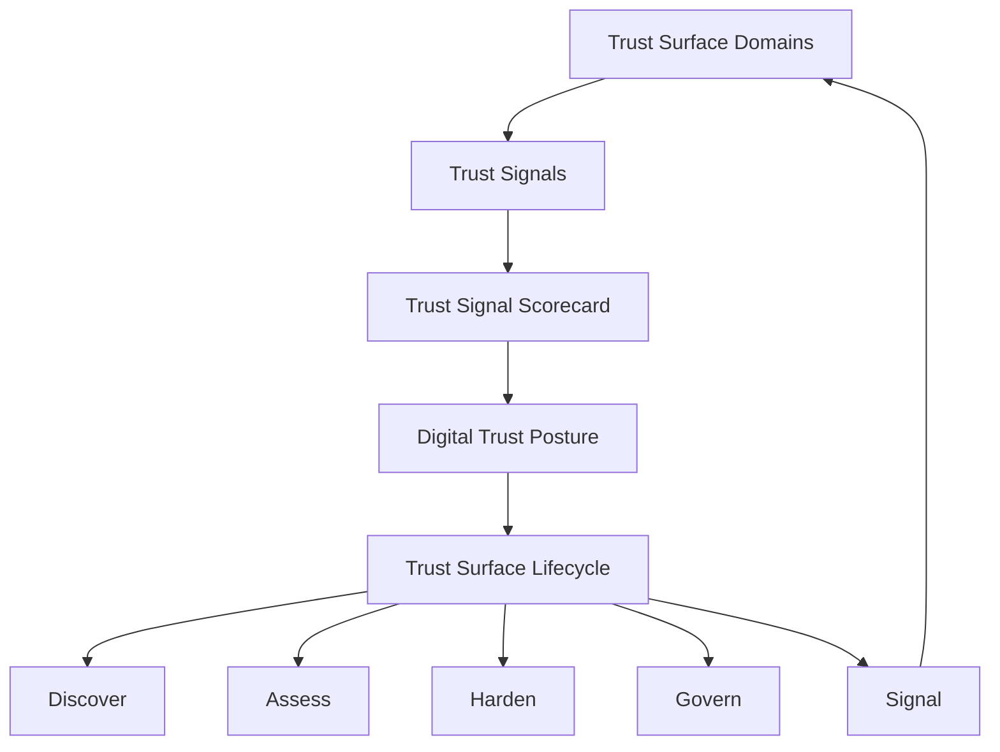

# Trust Surface Framework (TSF) Map

TSF provides a structured model for understanding how digital systems influence stakeholder trust.

The framework connects four key elements:

- **Trust Surface** — where digital trust is experienced
- **Trust Signals** — observable indicators of trust posture
- **Trust Lifecycle** — how organisations manage digital trust
- **Governance Integration** — how trust becomes part of organisational oversight

Together, these elements help organisations understand and manage their **Digital Trust Posture**.

## Framework overview

## Trust Surface domains

The Trust Surface represents the digital systems through which stakeholders experience an organisation’s digital presence.

| Domain | Description |
|---|---|
| Identity | Authentication and identity systems |
| Domains & DNS | Domain ownership and DNS infrastructure |
| Email Integrity | Authenticity of organisational email communications |
| Digital Services | Websites, applications, and online platforms |
| Infrastructure & Platforms | Technical environments supporting services |
| Third-Party Ecosystem | External vendors and SaaS platforms |

## Trust Signals

Each domain emits **observable signals** that indicate how well digital systems are governed.

Examples include SPF/DKIM/DMARC, DNS integrity, TLS configuration, service reliability indicators, and vendor assurances.

## Trust Surface Lifecycle

TSF defines a continuous lifecycle:

Discover → Assess → Harden → Govern → Signal

See **framework/06-trust-surface-lifecycle.md**.

## Status

This document forms part of **TSF v0.1**, published for consultation.
