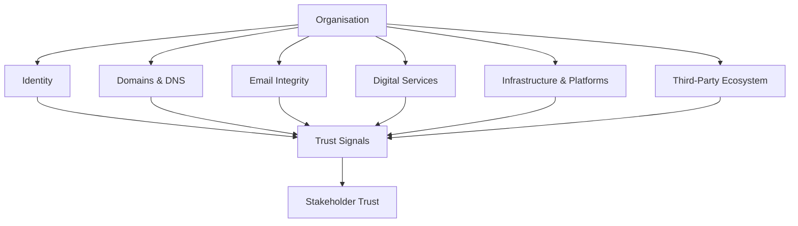

# The Trust Surface Diagram

This should become **the defining visual of the framework**.

Conceptually it shows:

* the **organisation at the centre**
* the **digital systems forming the Trust Surface**
* the **signals emitted outward to the world**

Here is the first version for the repo.

---

# The Trust Surface Model


```mermaid
flowchart TB
  O((Organisation))

  I[Identity]
  D[Domains & DNS]
  E[Email Integrity]
  S[Digital Services]
  P[Infrastructure & Platforms]
  T[Third-Party Ecosystem]

  O --- I
  O --- D
  O --- E
  O --- S
  O --- P
  O --- T

  I --> X[Trust Signals]
  D --> X
  E --> X
  S --> X
  P --> X
  T --> X

  X --> Z[Stakeholder Trust]
---

# How to Explain the Diagram

This is the **boardroom explanation**.

> Organisations emit digital signals through the systems they operate.
>
> These systems form the organisation’s **Trust Surface**.
>
> Stakeholders interpret these signals — consciously or unconsciously — to decide whether the organisation can be trusted online.

Those stakeholders include:

* customers
* partners
* employees
* regulators

Weak signals can lead to:

* phishing success
* brand impersonation
* service distrust
* reputational damage

The Trust Surface Framework helps organisations **identify, measure, and govern these signals**.

---

# The One-Sentence Explanation

When showing the diagram, you say:

> **“Every organisation emits digital trust signals. The Trust Surface Framework helps you understand and govern them.”**

That line is simple and powerful.

---

# Why This Diagram Works

It communicates three key ideas instantly:

1. **Trust comes from signals**
2. **Signals come from systems**
3. **Systems must be governed**

Most cybersecurity frameworks focus on **defence**.

This framework focuses on **perception and trust**.

That distinction is important.

---

# The More Powerful Version (Later)

Eventually the diagram evolves into something closer to this mental model:

```
              Stakeholders
                  ▲
                  │
           Trust Signals
                  ▲
        ┌─────────────────┐
        │  Trust Surface  │
        │                 │
        │ Identity        │
        │ Domains & DNS   │
        │ Email Integrity │
        │ Digital Services│
        │ Infrastructure  │
        │ Third-Party     │
        └─────────────────┘
                  ▲
             Organisation
```

This becomes the **signature graphic of the framework**.
