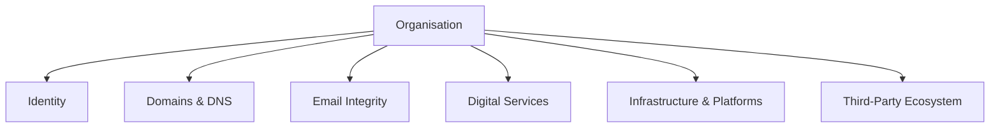

# Trust Surface Map

The Trust Surface Map describes the primary digital domains that collectively shape an organisation’s digital trust posture.

Each domain represents an area where stakeholders interact with, or form perceptions about, the organisation’s digital presence.

## The six Trust Surface domains

- Identity
- Domains & DNS
- Email Integrity
- Digital Services
- Infrastructure & Platforms
- Third-Party Ecosystem

## Architecture

## Domain descriptions (summary)

### Identity
How users, administrators, and services authenticate and gain access.

### Domains & DNS
Domain ownership, DNS configuration, and registrar governance.

### Email Integrity
SPF/DKIM/DMARC and mail transport protections that prevent impersonation.

### Digital Services
Websites, portals, apps, APIs — the systems stakeholders interact with.

### Infrastructure & Platforms
Cloud/hosting environments, resilience, and platform hygiene.

### Third-Party Ecosystem
SaaS vendors and integrations that influence trust outcomes.
