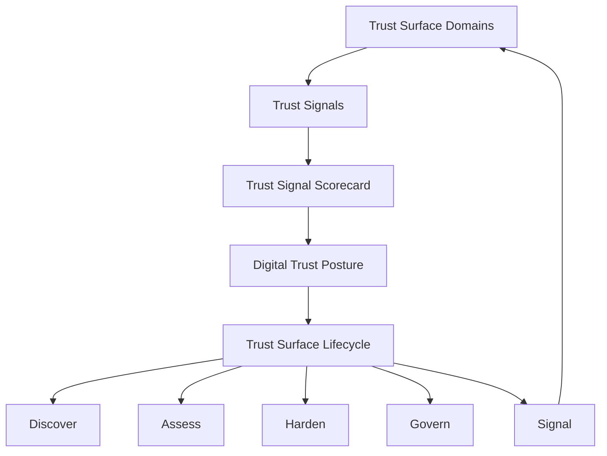

# Trust Surface Framework Map

The **Trust Surface Framework (TSF)** provides a structured model for understanding how digital systems influence stakeholder trust.

The framework connects four key elements:

* **Trust Surface** – where digital trust is experienced
* **Trust Signals** – observable indicators of trust posture
* **Trust Lifecycle** – how organisations manage digital trust
* **Governance Integration** – how trust becomes part of organisational oversight

Together, these elements help organisations understand and manage their **Digital Trust Posture**.

---

# Framework Overview



This model illustrates how organisations move from identifying their digital systems to governing their digital trust posture.

---

# Trust Surface Domains

The **Trust Surface** represents the digital systems through which stakeholders experience an organisation’s digital presence.

The framework identifies six primary domains.

| Domain                     | Description                                         |
| -------------------------- | --------------------------------------------------- |
| Identity                   | Authentication and identity systems                 |
| Domains & DNS              | Domain ownership and DNS infrastructure             |
| Email Integrity            | Authenticity of organisational email communications |
| Digital Services           | Websites, applications, and online platforms        |
| Infrastructure & Platforms | Technical environments supporting services          |
| Third-Party Ecosystem      | External vendors and SaaS platforms                 |

These domains collectively form the organisation’s **digital edge**.

---

# Trust Signals

Each Trust Surface domain emits **observable signals** that indicate how well digital systems are governed.

Examples include:

* SPF, DKIM, and DMARC email authentication
* DNS configuration and DNSSEC adoption
* TLS encryption and certificate hygiene
* service reliability indicators
* vendor security attestations

These signals allow organisations to measure digital trust posture objectively.

---

# Trust Signal Scorecard

Signals are evaluated using a maturity model.

Example:

| Domain           | Maturity |
| ---------------- | -------- |
| Identity         | Level 3  |
| Domains & DNS    | Level 4  |
| Email Integrity  | Level 2  |
| Digital Services | Level 3  |
| Infrastructure   | Level 2  |
| Third-Party      | Level 1  |

The scorecard provides an overview of the organisation’s **Digital Trust Posture**.

---

# Trust Surface Lifecycle

The framework defines a continuous lifecycle for governing digital trust.

```
Discover → Assess → Harden → Govern → Signal
```

### Discover

Identify the systems that make up the Trust Surface.

### Assess

Evaluate systems using the Trust Signal Catalogue.

### Harden

Strengthen weak or inconsistent trust signals.

### Govern

Integrate trust signals into governance and risk management.

### Signal

Communicate trust posture to stakeholders.

The lifecycle repeats as digital systems evolve.

---

# Relationship to Governance

The Trust Surface Framework complements existing governance and cybersecurity practices.

It provides a mechanism for translating technical signals into governance insights.

This allows executives and boards to better understand:

* where digital trust risks exist
* how well trust signals are maintained
* how trust failures might affect reputation and operations

---

# Framework Components

The Trust Surface Framework currently includes the following documents.

| Document                 | Purpose                                                |
| ------------------------ | ------------------------------------------------------ |
| Digital Trust Problem    | Explains why digital trust needs structured governance |
| Trust Principles         | Foundational principles guiding the framework          |
| Trust Surface Definition | Defines the concept of a Trust Surface                 |
| Trust Surface Map        | Describes the six Trust Surface domains                |
| Trust Signal Catalogue   | Lists measurable trust signals                         |
| Trust Surface Lifecycle  | Explains how organisations manage digital trust        |

Together these components form **Trust Surface Framework v0.1**.

---

# Status

This framework is currently published as a **draft for consultation**.

The model may evolve as organisations explore practical ways to measure and govern digital trust.
