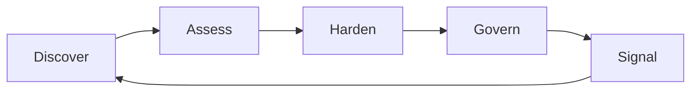

# Trust Surface Lifecycle

The **Trust Surface Lifecycle** provides a structured process for identifying, assessing, improving, and governing an organisation’s digital trust posture.

Digital trust is not a static state.
Changes in infrastructure, vendors, domains, or services can continuously alter the signals emitted by an organisation’s digital environment.

The lifecycle model ensures that digital trust is **actively maintained rather than assumed**.

---

# Lifecycle Overview

The Trust Surface Framework uses a five-stage lifecycle:

```id="m3r1bt"
Discover → Assess → Harden → Govern → Signal
```

Each stage contributes to understanding and maintaining digital trust posture.

---

# Lifecycle Model



The lifecycle is continuous.
Trust posture should be reviewed and improved regularly.

---

# Stage 1 — Discover

The **Discover** stage focuses on identifying the systems that make up the organisation’s Trust Surface.

Many organisations do not maintain a complete inventory of digital systems that influence trust.

Examples include:

* registered domains
* DNS infrastructure
* email platforms
* websites and digital services
* cloud platforms
* third-party SaaS providers

The outcome of this stage is the creation of a **Trust Surface Inventory**.

This inventory forms the foundation for assessing digital trust posture.

---

# Stage 2 — Assess

The **Assess** stage evaluates the Trust Surface using the **Trust Signal Catalogue**.

Signals are observed or verified to determine how well each domain demonstrates trustworthy behaviour.

Examples include:

* DMARC enforcement
* TLS configuration
* DNS integrity
* service reliability
* vendor security attestations

The outcome of this stage is a **Trust Signal Scorecard** and an overall **Digital Trust Posture assessment**.

This provides a clear picture of where trust signals are strong and where weaknesses exist.

---

# Stage 3 — Harden

The **Harden** stage focuses on strengthening weak or inconsistent trust signals.

Typical actions include:

* enforcing DMARC policies
* improving domain governance
* strengthening authentication mechanisms
* improving service reliability
* addressing vendor governance gaps

The goal is to reduce the likelihood of trust failures occurring at the organisation’s digital edge.

The outcome of this stage is a **Trust Hardening Plan**.

---

# Stage 4 — Govern

The **Govern** stage integrates digital trust into organisational governance practices.

This ensures that trust signals remain consistent over time and are not weakened by organisational change.

Governance mechanisms may include:

* assigning accountability for Trust Surface domains
* incorporating trust signals into risk reporting
* integrating trust posture into vendor review processes
* establishing regular Trust Surface reviews

The outcome of this stage is a **Digital Trust Governance Model** aligned with existing organisational risk practices.

---

# Stage 5 — Signal

The **Signal** stage focuses on communicating digital trust posture to stakeholders.

Trust signals are not only technical indicators but also opportunities to demonstrate transparency and accountability.

Examples include:

* service status transparency
* security transparency reporting
* clear communication during incidents
* demonstrating adoption of best practices

When organisations openly communicate trust posture, stakeholder confidence can increase.

---

# Continuous Improvement

The Trust Surface Lifecycle is continuous.

Changes in infrastructure, technology platforms, or organisational structure can alter trust posture over time.

Regular reassessment ensures that trust signals remain strong and consistent.

Organisations should periodically repeat the lifecycle to maintain and improve digital trust.

---

# Relationship to Governance

The lifecycle complements existing governance and risk management frameworks.

It provides a practical mechanism for translating technical signals into governance insights.

Executives and boards can use lifecycle outputs to understand:

* where digital trust risks exist
* how effectively trust signals are maintained
* where governance improvements may be required

---

# Lifecycle Outputs

Each lifecycle stage produces tangible outputs.

| Stage    | Output                         |
| -------- | ------------------------------ |
| Discover | Trust Surface Inventory        |
| Assess   | Trust Signal Scorecard         |
| Harden   | Trust Hardening Plan           |
| Govern   | Digital Trust Governance Model |
| Signal   | Trust Transparency Mechanisms  |

These outputs provide a structured record of how digital trust is managed.

---

# Why the Lifecycle Matters

Without a lifecycle approach, organisations often address digital trust issues only after incidents occur.

The Trust Surface Lifecycle encourages proactive identification and governance of trust signals.

By continuously observing and improving the Trust Surface, organisations can strengthen digital trust before failures occur.

---

# Status of This Document

This document forms part of the **Trust Surface Framework draft**, published for consultation and discussion.

The lifecycle model may evolve as organisations apply the framework and identify practical improvements.
