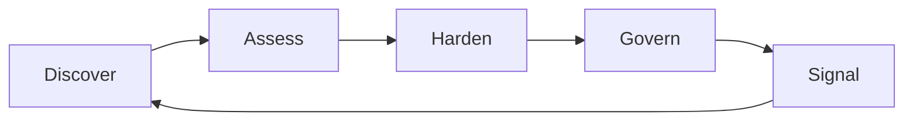

# Trust Surface Lifecycle

Digital trust is not static. Changes in infrastructure, vendors, domains, or services can alter the signals an organisation emits.

TSF uses a five-stage lifecycle:

Discover → Assess → Harden → Govern → Signal

## Discover
Identify the systems that make up the Trust Surface (inventory domains, services, vendors, identity surfaces).

**Output:** Trust Surface Inventory

## Assess
Evaluate the Trust Surface using the Trust Signal Catalogue.

**Output:** Trust Signal Scorecard + Digital Trust Posture summary

## Harden
Strengthen weak or inconsistent trust signals (e.g. DMARC enforcement, domain governance, resilience improvements).

**Output:** Trust Hardening Plan (prioritised)

## Govern
Embed trust into governance: accountable owners, reporting, vendor review, risk integration.

**Output:** Digital Trust Governance Model (roles, cadence, reporting)

## Signal
Communicate trust posture transparently where appropriate (status comms, incident comms, trust indicators).

**Output:** Trust transparency mechanisms and comms practices
